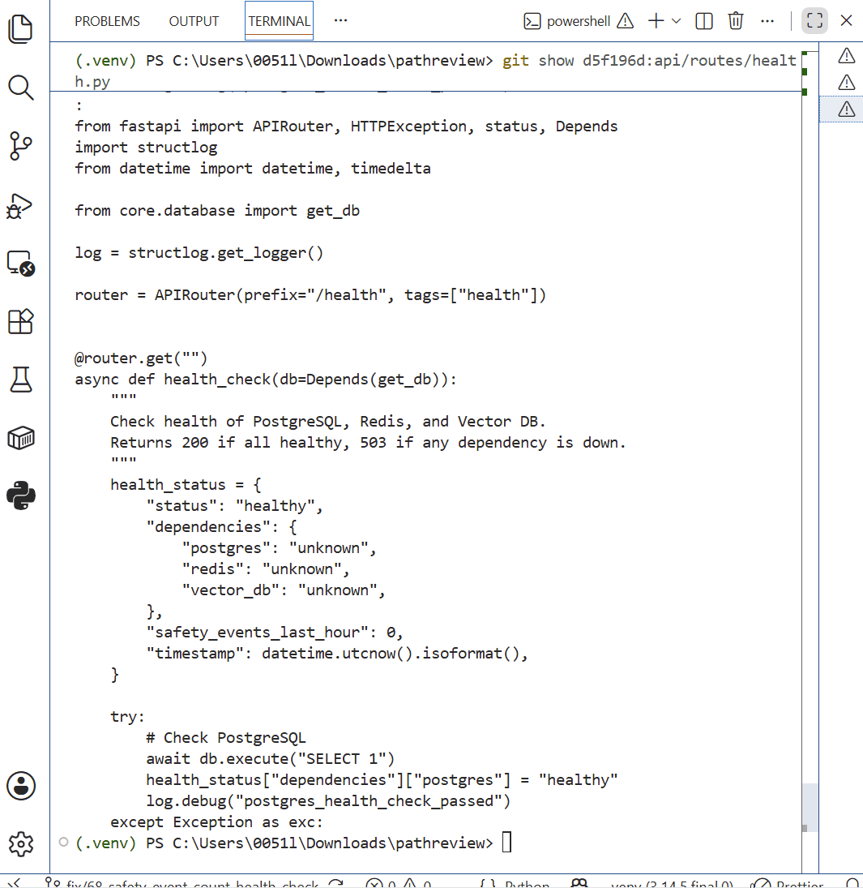

## Week 7 — Issue selection

**Issue link:** https://github.com/ascherj/pathreview/issues/68

**Issue title:** Add a safety event count to the health check endpoint

**Tier:** [x] Tier 1 [ ] Tier 2 [ ] Tier 3

**Problem summary:**
The `/health` API endpoint currently reports the status of the application's dependencies, but its safety event metric is not connected to the actual safety monitoring system. The `safety_events_last_hour` field currently returns a placeholder value of zero, so operators cannot use the health endpoint to see recent safety activity. This issue affects `api/routes/health.py` and `safety/monitoring.py`. A successful fix would connect the health check to the safety monitoring data and return an accurate count of safety events from the last hour.

**Is this right for me? — Selection reasoning:**
I selected this issue because it is a Tier 1 issue with a limited and clearly defined scope. The relevant code is mainly contained in two Python files, and the existing `SafetyMonitor` class already provides event-counting functionality that I can investigate and extend. The issue will give me experience working with an existing FastAPI endpoint, Redis-based monitoring, and automated testing without requiring major architectural changes. Based on the stated scope and estimated effort, I believe I can complete and test the change within the Module 3 timeline.

**Branch name:** fix/68-safety-event-count-health-check

**Setup confirmation:** [x] App runs locally at localhost:5173

**Cohort ledger:** [x] Issue added to cohort ledger

## Week 8 — Reproduction & solution planning

**Reproduction commit link:** [\[Paste the GitHub link to the reproduction commit here\]](https://github.com/bing-ying-li/pathreview/blob/fix/68-safety-event-count-health-check/REPRODUCTION.md)

**Reproduction summary:**
I reproduced the issue by reviewing the pre-fix version of `api/routes/health.py`. The `safety_events_last_hour` field was initialized to `0` and was never updated using recent safety event data from Redis, causing the health endpoint to always report zero events.

**PLAN.md link:** [\[Paste the GitHub link to PLAN.md here\]](https://github.com/bing-ying-li/pathreview/blob/fix/68-safety-event-count-health-check/PLAN.md)

**Walkthrough video (recommended):**

**Blockers or open questions:**
The repository currently has several unrelated failing unit tests. Testing for this issue will focus on `tests/unit/test_health.py` and `tests/unit/test_safety_monitoring.py`.
